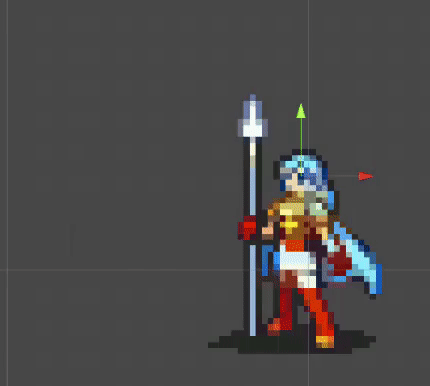

# 2D animation in Unity with different sprite sizes

Just a simple animation with different sprite sizes to show how pivots can be used to help on that.

I've made a post explaining this setup [here](https://theguspassos.github.io/blog/#/post/2d-animation-in-unity-with-different-sprite-sizes).

## Credits

- Erika's animation was made by [MissKilvas](https://www.deviantart.com/misskilvas).
- The robot guy animation was made by [irmirx](https://opengameart.org/users/irmirx).
